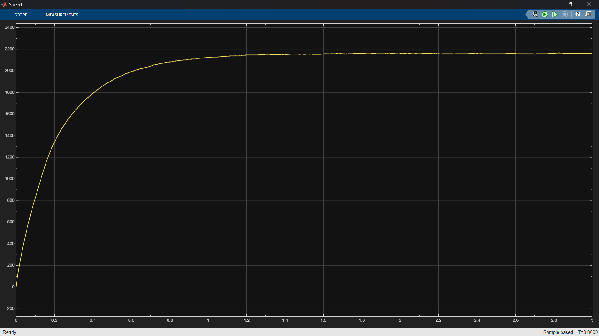
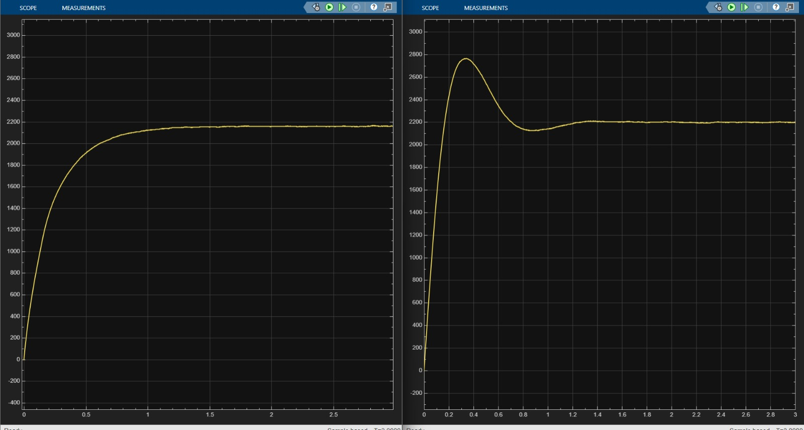

# FOC of PMSM using Fuzzy Logic Controller (MATLAB/Simulink)

## Overview

This project implements **Field Oriented Control (FOC)** for a Permanent Magnet Synchronous Motor (PMSM) using a **Fuzzy Logic Controller** and compares its performance with a conventional **PI Controller**.

The goal is to improve transient response and reduce overshoot in PMSM speed control.

---

##  Objective

* Replace traditional PI control with fuzzy logic Controller
* Improve system stability and robustness
* Analyze performance using simulation metrics

---

##  System Architecture

* Clarke & Park Transformations (abc → dq)
* dq-axis current control
* Speed control loop using:

  * PI Controller
  * Fuzzy Logic Controller (.fis)
* PWM generation and inverter model
* PMSM motor model with feedback

---

##  Results

###  Speed Response

###  PI vs Fuzzy Comparison

---

##  Performance Comparison

| Parameter     | PI Controller | Fuzzy Controller |
| ------------- | ------------- | ---------------- |
| Rise Time     |  0.1284 sec   |    0.5158 sec    |
| Settling Time |  1.0569 sec   |    0.9572 sec    |
| Overshoot     |  25.78 %      |    0.33 %        |

---

##  Observations

* Fuzzy controller significantly **reduces overshoot**
* Faster and smoother settling compared to PI controller
* Better handling of system non-linearity
* Improved overall stability

---

##  Tools Used

* MATLAB
* Simulink
* Fuzzy Logic Toolbox

---

##  Project Files

* `foc_fuzzy.slx` → Main Simulink model
* `fuzzy_controller.fis` → Fuzzy logic design
* `pi_vs_fuzzy.png` → Comparison plot
* `speed_plot.png` → Speed response

---

##  How to Run

1. Open MATLAB
2. Open `foc_fuzzy.slx`
3. You can change Reference speed which is done by changing the constant Value in the subsystem in Bottom right(in .slx file).
4. Make Sure you have then in the Files(in Workspace).
5. Load `fuzzy_controller.fis`
6. Run the simulation

---

